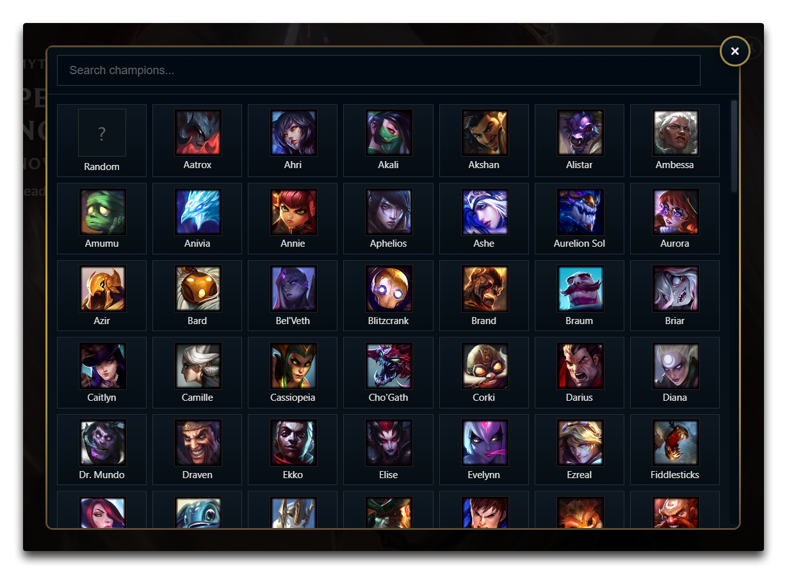
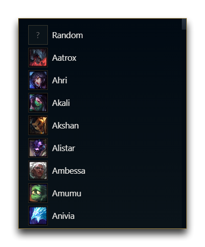

# Auto Champ Lock

Fork of `auto-champion-select` with:

- One ban slot
- Five pick slots (top, jungle, mid, support, adc)
- Automatic role detection in champ select
- **Favourite champions** – Star champions to pin them to the top of the list
- **Champion picker modal** – Full grid with search, portraits, and favourites
- **Search popover** – Type in the dropdown to filter champions with a compact popup above the UI
- **Pop-out modal** – Expand the panel into a standalone window with the same theme
- **Lock-in toggle** – Optional manual lock-in button in champ select

## Preview

Role-based pick and ban panel:

Champ-select lock-in toggle:

Champion picker modal (pop-out):

Search popover (type in dropdown):

## Notes

- Uses the same DataStore keys as the original plugin (`controladoPick`, `controladoBan`, `controladoAutoAccept`).
- Legacy 2-pick/2-ban configs are automatically migrated to the new structure.
- Keep only one of the two plugins enabled if you do not want duplicate UI sections.
- Favourites are stored in `controladoFavorites`.
