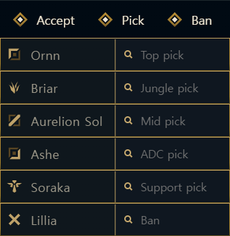
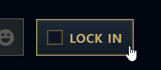

# Auto Champion Select (Role Picks Fork)

Fork of `auto-champion-select` with:

- One ban slot
- Five pick slots (top, jungle, mid, support, adc)
- Automatic role detection in champ select

## Preview

Role-based pick and ban panel:

Champ-select lock-in toggle:

## Notes

- Uses the same DataStore keys as the original plugin (`controladoPick`, `controladoBan`, `controladoAutoAccept`).
- Legacy 2-pick/2-ban configs are automatically migrated to the new structure.
- Keep only one of the two plugins enabled if you do not want duplicate UI sections.
